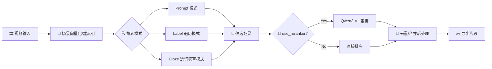

# Auto-scenes-extraction

## Runtime Versions

- Python: `3.11.2`
- torch: `2.9.1+cu128` (embedded Python)
- transformers: `4.57.0` (embedded Python)

🌐 **Language / 语言**: 中文 | English

---

## 中文版

### 项目简介 🎬

`Auto-scenes-extraction` 是一个本地视频场景检索工具：  
先把视频做成场景向量索引，再通过自然语言搜索，最后可导出命中的视频片段。

### 核心能力 ✨

- 🧩 视频向量化：按场景抽帧并生成向量索引
- 🔎 文本检索：输入描述语句召回相关场景
- 🧠 二阶段重排：CLIP 召回 + Qwen3-VL Reranker 精排
- ✂️ 结果导出：按帧区间切片导出命中片段

### 主体逻辑（端到端）🛠️

### 入口文件 📍

- `pipeline_app.py`：流水线主入口（建索引 + 多种搜索模式）
- `text_search.py`：语义检索 Web 服务入口
- `启动自动提纯.bat`：启动流水线界面（建索引 + 自动提纯搜索）
- `启动语义搜视频.bat`：启动语义检索界面（交互式文搜视频）

### Logic Explanation 📚

- Prompt 模式执行逻辑：`logic_explanation/P模式执行逻辑.md`
- Prompt 模式执行逻辑图（含 Mermaid 流程图）：`logic_explanation/P模式执行逻辑图.md`
- text_search 执行逻辑：`logic_explanation/text_search执行逻辑.md`
- 视频向量化逻辑：`logic_explanation/视频向量化逻辑.md`
- logic_keywords 设计说明：`logic_explanation/logic_keywords.md`

### `logic_keywords.json` 的作用 🧩

- 统一维护标签词库与中英映射（`PL标签`）。
- 定义标签组合约束（`分配规则`），减少无效 prompt 组合。
- 提供 Cloze 模式模板与可填词（`选词填空规则`）。
- 作为缓存版本依据：文件变更后会触发关键词/Prompt 缓存重建。

### 两大子系统 🏗️

本项目包含两个独立的 Flask Web 服务：

| 子系统 | 入口 | 启动脚本 | 前端页面 | 用途 |
|---|---|---|---|---|
| 自动提纯流水线 | `pipeline_app.py` | `启动自动提纯.bat` | `Pipeline_control.html` | 视频建索引 + 批量自动搜索导出 |
| 语义搜视频 | `text_search.py` | `启动语义搜视频.bat` | `Frame_text_search.html` | 交互式单句文搜视频，支持预览/导出 |

两者共享 `A_coreUtils/` 下的核心模块（嵌入模型、Reranker、Lance 索引读写、视频处理等），但运行时互相独立。

### 视频向量化流程 🧮

1. FFmpeg 按 `sample_interval` 间隔抽帧，短边缩放到 `output_resolution`
2. 双缓冲流水线：多线程 I/O 加载 + GPU 批量推理并行，同步执行黑帧检测
3. 计算相邻帧向量余弦相似度，低于 `cosine_similarity_threshold` 处切分场景边界
4. 短场景（< `min_scene_length` 帧）合并到相邻最相似场景
5. 每个场景提取首/中/尾三帧特征向量，L2 归一化后写入 Lance 索引
6. 支持增量处理（`resume_processing`）：跳过已索引视频

支持的嵌入模型：CLIP（`openai-clip-vit-large-patch14`）、FG-CLIP2（`qihoo360_fg-clip2-base`），自动检测模型类型。

### 三种搜索模式 🔍

**Prompt 模式（P模式）**：核心自动提纯模式
- 从 `logic_keywords.json` 读取标签词库，按 `分配规则` 遍历所有合理的关键词组合
- 使用 `prompt_template`（如 `"A {情绪} photo of a {主体} {动作} in {场景}."`）生成 Prompt 文本
- Prompt 向量缓存：基于模板+关键词+语言模式的哈希校验，变化时自动重建
- 搜索路径根据 `lance_batch_size` 自动选择：全量预加载 或 分批加载（支持 LMDB 断点续搜）
- 可选 Qwen3-VL Reranker 精排，融合公式：`clip_sim × (1-weight) + rerank_score × 100 × weight`
- 后处理：向量去重（`vector_dedup_threshold`）→ 相邻片段合并（`adjacent_merge_frames`）→ 视频导出

**Label 模式**：遍历预定义标签列表进行搜索

**Cloze 模式（选词填空）**：基于 `选词填空规则` 中的模板，将候选词填入槽位生成 Prompt

### text_search 语义检索 🔎

独立的交互式文搜视频服务，支持：
- 单句自然语言查询，多索引联合检索（要求同一嵌入模型）
- 可选二阶段重排：初筛阈值自动降低为 `max(5, threshold×0.5)` 以召回更多候选
- 可选跨视频去重：OP/ED 优先保留规则 + 矩阵余弦相似度去重
- 帧预览（`/get_preview`）、片段预览（`/get_clip`）、批量导出（`/export_clips`）
- 模型热切换：切换模型时自动释放旧模型显存

### P模式关键参数与缓存交互大图 📊

```mermaid
graph TD
    %% ========== 主流程 ==========
    START(["🖥️ 前端 collectConfig()"])
    DISPATCH["pipeline_app.py<br/>run_prompt_search_with_config"]
    ENTRY["run_interactive_search()"]

    %% ========== 关键参数节点 ==========
    P_template["prompt_template"]
    P_chinese["use_chinese"]
    P_fp16["use_fp16"]
    P_feat_fp16["feature_fp16"]
    P_cache_batch["prompt_cache_batch_size"]
    P_search_batch["prompt_search_batch_size"]
    P_lance_batch["lance_batch_size"]
    P_lance_workers["lance_load_workers"]
    P_diskcache["use_diskcache"]
    P_lmdb_batch["lmdb_write_batch_size"]
    P_search_mode["search_mode"]
    P_top_k["top_k"]
    P_reranker["use_reranker"]
    P_rerank_k["rerank_top_k"]
    P_rerank_batch["rerank_batch_size"]
    P_rerank_res["reranker_output_resolution"]
    P_cand_batch["candidate_batch_size"]
    P_dedup["vector_dedup_threshold"]
    P_merge["adjacent_merge_frames"]
    P_copy["video_copy_mode"]
    P_offset["start/end_frame_offset"]
    P_debug["debug_similarity"]

    %% ========== Prompt向量缓存 ==========
    subgraph PROMPT_CACHE["💾 Prompt向量缓存<br/>PromptVectorCache"]
        PC_CHECK{"缓存存在?<br/>哈希校验:<br/>template+keywords+chinese"}
        PC_MISS["加载CLIP模型<br/>分批编码Prompt→向量<br/>写入缓存文件"]
        PC_HIT["跳过模型加载"]
        PC_ITER["分批读取向量<br/>cache_iterator"]
    end

    %% ========== 搜索引擎 ==========
    subgraph SEARCH_ENGINE["🔍 BatchTextSearchEngine"]
        SE_INIT["初始化引擎<br/>加载Lance索引"]
        SE_HASH["config_hash<br/>= MD5(所有搜索参数)"]
        SE_BRANCH{"lance_batch_size<br/>vs Lance总数?"}
    end

    %% ========== 全量预加载路径 ==========
    subgraph PATH_A["路径A: 全量预加载"]
        A_LOAD["一次性加载全部Lance到GPU"]
        A_SEARCH["遍历cache_iterator<br/>余弦相似度计算"]
    end

    %% ========== 分批加载路径 ==========
    subgraph PATH_B["路径B: 分批加载"]
        B_LMDB_CHECK{"LMDB checkpoint<br/>config_hash匹配?"}
        B_RESUME["从断点继续"]
        B_RESTART["清空LMDB重来"]
        B_LOOP["每批加载lance_batch_size个Lance"]
        B_SEARCH["CLIP搜索→结果写入LMDB"]
        B_SAVE["保存checkpoint+释放GPU"]
        B_MERGE["LMDB合并全部结果"]
    end

    %% ========== LMDB搜索结果缓存 ==========
    subgraph LMDB_CACHE["💾 LMDB搜索结果缓存"]
        LMDB_INNER["inner_search/<br/>搜索候选结果"]
        LMDB_LANCE["lance_merge/<br/>Lance合并结果"]
        LMDB_CP["checkpoint<br/>config_hash + batch_idx"]
    end

    %% ========== Reranker ==========
    RERANK_CHECK{"use_reranker?"}
    subgraph RERANKER["🎯 Reranker精排"]
        RR_LOAD["加载Qwen3-VL-Reranker"]
        RR_EXEC["候选场景重排序"]
        RR_CACHE["rerank_cache/<br/>帧图像缓存"]
    end

    %% ========== 后处理 ==========
    DEDUP_CHECK{"vector_dedup<br/>_threshold?"}
    DEDUP["向量去重<br/>优先保留OP/ED"]
    MERGE_CHECK{"adjacent_merge<br/>_frames?"}
    MERGE_EXEC["相邻片段合并"]
    EXPORT["视频导出"]
    CLEANUP["清理临时文件"]

    %% ========== 前端→后端 连接 ==========
    %% ========== 主流程连接 ==========
    START --> DISPATCH --> ENTRY
    ENTRY --> PC_CHECK

    %% ========== Prompt缓存流程 ==========
    PC_CHECK -->|"哈希不匹配"| PC_MISS --> PC_ITER
    PC_CHECK -->|"哈希匹配"| PC_HIT --> PC_ITER
    PC_ITER --> SE_INIT

    %% ========== 搜索引擎流程 ==========
    SE_INIT --> SE_HASH --> SE_BRANCH
    SE_BRANCH -->|"None 或 >= 总数"| A_LOAD
    SE_BRANCH -->|"< 总数"| B_LMDB_CHECK

    %% ========== 路径A ==========
    A_LOAD --> A_SEARCH --> RERANK_CHECK

    %% ========== 路径B ==========
    B_LMDB_CHECK -->|"匹配"| B_RESUME --> B_LOOP
    B_LMDB_CHECK -->|"不匹配"| B_RESTART --> B_LOOP
    B_LOOP --> B_SEARCH --> B_SAVE
    B_SAVE -->|"还有批次"| B_LOOP
    B_SAVE -->|"全部完成"| B_MERGE --> RERANK_CHECK

    %% ========== Reranker ==========
    RERANK_CHECK -->|"是"| RR_LOAD --> RR_EXEC --> DEDUP_CHECK
    RERANK_CHECK -->|"否"| DEDUP_CHECK

    %% ========== 后处理 ==========
    DEDUP_CHECK -->|"是"| DEDUP --> MERGE_CHECK
    DEDUP_CHECK -->|"否"| MERGE_CHECK
    MERGE_CHECK -->|"是"| MERGE_EXEC --> EXPORT
    MERGE_CHECK -->|"否"| EXPORT
    EXPORT --> CLEANUP

    %% ========== 参数→Prompt缓存 ==========
    P_template -.->|"影响哈希"| PC_CHECK
    P_chinese -.->|"影响哈希"| PC_CHECK
    P_fp16 -.->|"加载模型精度"| PC_MISS
    P_cache_batch -.->|"生成批大小"| PC_MISS
    P_search_batch -.->|"读取批大小"| PC_ITER

    %% ========== 参数→搜索引擎 ==========
    P_lance_workers -.-> SE_INIT
    P_feat_fp16 -.-> SE_INIT
    P_search_mode -.-> SE_INIT
    P_top_k -.-> SE_INIT
    P_lance_batch -.->|"决定路径"| SE_BRANCH

    %% ========== 参数→LMDB缓存 ==========
    P_diskcache -.->|"总开关"| SE_HASH
    P_lmdb_batch -.->|"写入批大小"| B_SEARCH
    SE_HASH -.->|"config_hash"| LMDB_CP
    B_SEARCH -.->|"写入"| LMDB_INNER
    B_SEARCH -.->|"写入"| LMDB_LANCE
    B_SAVE -.->|"保存"| LMDB_CP
    B_LMDB_CHECK -.->|"读取"| LMDB_CP

    %% ========== 参数→Reranker ==========
    P_reranker -.-> RERANK_CHECK
    P_rerank_k -.-> RR_EXEC
    P_rerank_batch -.-> RR_EXEC
    P_rerank_res -.-> RR_EXEC
    P_rerank_res -.->|"影响缓存键"| RR_CACHE
    P_cand_batch -.-> RR_EXEC

    %% ========== 参数→后处理 ==========
    P_dedup -.-> DEDUP_CHECK
    P_merge -.-> MERGE_CHECK
    P_copy -.-> EXPORT
    P_offset -.-> EXPORT
    P_debug -.-> EXPORT

    %% ========== 样式 ==========
    classDef param fill:#e3f2fd,stroke:#1565c0,color:#0d47a1
    classDef cache fill:#fce4ec,stroke:#c62828,color:#b71c1c
    classDef decision fill:#fff9c4,stroke:#f9a825,color:#f57f17
    classDef process fill:#e8f5e9,stroke:#2e7d32,color:#1b5e20

    class P_template,P_chinese,P_fp16,P_feat_fp16,P_cache_batch,P_search_batch param
    class P_lance_batch,P_lance_workers,P_diskcache,P_lmdb_batch param
    class P_search_mode,P_top_k,P_reranker,P_rerank_k,P_rerank_batch param
    class P_rerank_res,P_cand_batch,P_dedup,P_merge,P_copy,P_offset,P_debug param
    class PROMPT_CACHE,LMDB_CACHE,RERANKER cache
    class PC_CHECK,SE_BRANCH,B_LMDB_CHECK,RERANK_CHECK,DEDUP_CHECK,MERGE_CHECK decision
    class DISPATCH,ENTRY,SE_INIT,A_LOAD,A_SEARCH,B_LOOP,B_SEARCH,B_MERGE,EXPORT process
```

### 快速开始 🚀

1. 将所需模型放到 `models/` 目录下（至少需要一个 CLIP 系嵌入模型，可选 Reranker 模型）：
   - 嵌入模型：`openai-clip-vit-large-patch14` 或 `qihoo360_fg-clip2-base`
   - Reranker（可选）：`Qwen3-VL-Reranker-2B`
   - FFmpeg：`models/ffmpeg/bin/` 下放置 `ffmpeg.exe`
2. 将待处理视频放入 `videos/` 目录（或在 Web UI 中指定路径）
3. 运行：
   - `启动自动提纯.bat` → 打开流水线界面，先建索引再执行自动搜索导出
   - `启动语义搜视频.bat` → 打开语义检索界面，输入描述语句交互式搜索
4. 在 Web UI 中配置参数并执行任务
5. 导出结果默认保存到 `output/` 目录

> 两个 bat 脚本使用项目内嵌入式 Python（`python/python.exe`），无需额外安装 Python 环境。

---

## English

### Overview 🎬

`Auto-scenes-extraction` is a local video scene retrieval tool.  
It builds scene-level vector indexes from videos, supports natural-language
search, and exports matched clips.

### Key Features ✨

- Scene vector indexing from videos
- Text-to-scene retrieval
- Two-stage ranking (embedding recall + reranker refinement)
- Clip export with frame-range control

### Main Entry Points 📍

- `pipeline_app.py`: end-to-end pipeline entry (indexing + auto search & export)
- `text_search.py`: semantic search service entry (interactive text-to-video search)
- `启动自动提纯.bat`: launch pipeline UI
- `启动语义搜视频.bat`: launch text search UI

### Deep-Dive Docs 📚

- `logic_explanation/P模式执行逻辑.md` — Prompt mode execution logic
- `logic_explanation/P模式执行逻辑图.md` — Prompt mode flowchart (Mermaid)
- `logic_explanation/text_search执行逻辑.md` — text_search execution logic
- `logic_explanation/视频向量化逻辑.md` — Video vectorization logic
- `logic_explanation/logic_keywords.md` — logic_keywords design notes

### What `logic_keywords.json` Does 🧩

- Central keyword dictionary and zh/en mapping (`PL标签`).
- Category-combination constraints (`分配规则`) to avoid invalid prompt pairs.
- Cloze templates and candidate tokens (`选词填空规则`).
- Cache invalidation key: updates trigger keyword/prompt cache regeneration.

### Two Subsystems 🏗️

| Subsystem | Entry | Launch Script | Frontend | Purpose |
|---|---|---|---|---|
| Auto-purify Pipeline | `pipeline_app.py` | `启动自动提纯.bat` | `Pipeline_control.html` | Video indexing + batch auto search & export |
| Semantic Video Search | `text_search.py` | `启动语义搜视频.bat` | `Frame_text_search.html` | Interactive text-to-video search with preview & export |

Both share core modules under `A_coreUtils/` (embedding models, reranker, Lance index I/O, video processing) but run independently.

### Video Vectorization Pipeline 🧮

1. FFmpeg extracts frames at `sample_interval` intervals, short-edge scaled to `output_resolution`
2. Double-buffered pipeline: multi-threaded I/O loading + GPU batch inference in parallel, with synchronous black frame detection
3. Cosine similarity between adjacent frame vectors; boundaries cut where similarity < `cosine_similarity_threshold`
4. Short scenes (< `min_scene_length` frames) merged into the most similar neighbor
5. First/middle/last frame features extracted per scene, L2-normalized, written to Lance index
6. Incremental processing supported (`resume_processing`): skips already-indexed videos

Supported embedding models: CLIP (`openai-clip-vit-large-patch14`), FG-CLIP2 (`qihoo360_fg-clip2-base`), auto-detected.

### Three Search Modes 🔍

**Prompt Mode (P)**: Core auto-purify mode
- Reads keyword library from `logic_keywords.json`, traverses valid combinations per `分配规则`
- Generates prompts via `prompt_template` (e.g. `"A {mood} photo of a {subject} {action} in {scene}."`)
- Prompt vector caching with hash-based invalidation
- Optional Qwen3-VL Reranker: `final = clip_sim × (1-weight) + rerank_score × 100 × weight`
- Post-processing: vector dedup → adjacent segment merge → video export

**Label Mode (L)**: Traverses predefined label list for search

**Cloze Mode (C)**: Fills candidate words into template slots from `选词填空规则`

### text_search Semantic Search 🔎

Standalone interactive text-to-video service:
- Single-sentence natural language query, multi-index joint retrieval (same embedding model required)
- Optional two-stage reranking: initial threshold auto-lowered to `max(5, threshold×0.5)` for broader recall
- Optional cross-video dedup: OP/ED priority rule + matrix cosine similarity dedup
- Frame preview (`/get_preview`), clip preview (`/get_clip`), batch export (`/export_clips`)
- Hot model switching: auto-releases old model VRAM on switch

---

## Acknowledgements 🙌

Thanks to all contributors to this project.

Core contributors:

- @彩绘的图案丶 [Bilibili](https://space.bilibili.com/4854520) | [YouTube](https://www.youtube.com/@TuanAMV)

Special thanks:

- @QQ346713889

Primary upstream projects used:

- CLIP: https://github.com/openai/CLIP
- Qwen3-VL-Embedding / Reranker: https://github.com/QwenLM/Qwen3-VL-Embedding
- FG-CLIP: https://github.com/360CVGroup/FG-CLIP
- FFmpeg: https://github.com/FFmpeg/FFmpeg

## License ⚖️

Project source code is licensed under Apache License 2.0.  
See `licenses/LICENSE`.

## Third-Party Components 📦

This repository includes third-party software, model files, and binaries with
their own licenses and terms.

See:

- `licenses/THIRD_PARTY_LICENSES.md`
- `licenses/NOTICE`

Important:

- `models/ffmpeg` is a GPLv3 build. If you redistribute this project with that
  binary, GPL obligations apply to the redistributed package.
- Model directories under `models/` may have separate terms from the project
  source code license. Review each model directory before redistribution.
