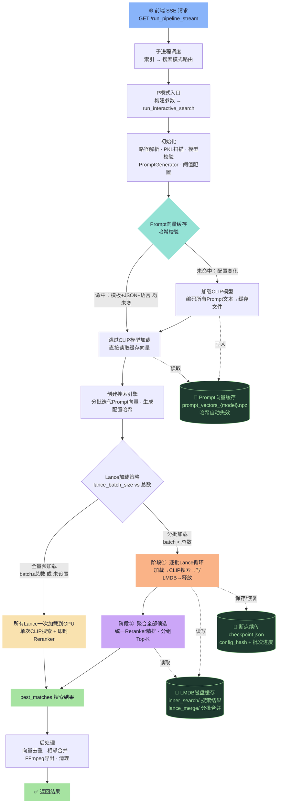

# P模式执行逻辑（基于 `pipeline_app.py` 当前实现）

更新时间：2026-02-16
代码依据：`Cut_DetectScene/pipeline_app.py`、`Cut_DetectScene/A_coreUtils/search/auto_scene_search.py`

## 1. 入口与调度链路

1. 前端调用 `GET /run_pipeline_stream`，把完整 `config` 作为 query 参数传入（SSE 流式返回日志）。
2. 后端创建子进程执行 `_run_pipeline_in_process` → `run_pipeline_thread(config)`（`pipeline_app.py:155-160`）。
3. `run_pipeline_thread`（`pipeline_app.py:749-813`）根据三个总开关决定执行路径：
   - `run_indexer`（默认 `True`）— 是否执行步骤1（视频索引）
   - `run_search`（默认 `True`）— 是否执行步骤2（场景搜索）
   - `search_entry_mode`（默认 `'prompt'`）— 搜索模式选择：`'prompt'` / `'label'` / `'cloze'`
4. 当 `search_entry_mode == 'prompt'` 时，进入 `run_prompt_search_with_config(config)`（`pipeline_app.py:786-787`）。

## 2. P模式执行步骤

`run_prompt_search_with_config`（`pipeline_app.py:437-549`）的实际流程如下：

1. **模块可用性检查**：`_PROMPT_SEARCH_AVAILABLE` 为 `False` 时直接失败返回。该标志在启动时通过 `from A_coreUtils.search.auto_scene_search import run_interactive_search` 是否成功来设置（`pipeline_app.py:62-66`）。
2. **读取配置段**：`ps_config = config.get('prompt_search', {})`。
3. **检查停止标志**：`_stop_requested.value` 为 `True` 时直接退出（跨进程共享的 `mp.Value('b', False)`，定义于 `pipeline_app.py:42`）。
4. **解析 LMDB 缓存目录**：`diskcache_dir = _resolve_diskcache_dir(ps_config.get('diskcache_dir'))`，通过 `_resolve_diskcache_dir()`（`pipeline_app.py:211-221`）统一解析，未配置时返回 `None` 让下游使用默认目录。
5. **构建参数字典 `kwargs`**：采用"仅传预设中明确存在的参数"策略，未设置的参数不传递，让下游函数 `run_interactive_search()` 使用自己的默认值。参数分为三类处理：
   - **路径配置**：`index_directory`、`output_directory` 通过 `resolve_path()` 解析为绝对路径
   - **需要类型转换的参数**：`search_mode` → `int()`、`top_k` → `_normalize_top_k()`、`start_frame_offset` / `end_frame_offset` → `int()`、`reranker_output_resolution` → `str()`
   - **布尔/字符串直通参数**：`use_fp16`、`use_reranker`、`video_output_directory`、`video_copy_mode`、`feature_fp16`、`use_diskcache`、`prompt_template`、`video_name_format`、`debug_similarity`、`use_chinese`、`vector_dedup_threshold`、`adjacent_merge_frames` — 仅在预设中存在且非 `None` 时才传递
   - **正整数参数**（经 `_normalize_optional_positive_int` 转换）：`rerank_top_k`、`rerank_batch_size`、`candidate_batch_size`、`prompt_search_batch_size`、`lance_batch_size`、`prompt_cache_batch_size`、`lance_load_workers`、`lmdb_write_batch_size` — 字段存在即透传，显式 `None`/`0` 表示"不限制/自动"
6. **Lance 索引目录校验**：调用 `_validate_lance_index_directory()`（`pipeline_app.py:258-281`）检查索引目录是否存在 `.lance` 文件，若检测到不支持的 `.pkl` 索引则报错。
7. **调用 `run_interactive_search(**kwargs)`**（`pipeline_app.py:520`）：实际检索主逻辑在 `auto_scene_search.py:2368`。
8. **返回值校验**：返回值必须是 `dict` 类型且 `success` 字段为 `True`，否则判定为失败。成功后记录初始结果数、导出前结果数和视频导出统计。
9. **成功后**：记录搜索耗时，推送进度到 `100%`。

## 3. 参数映射（`prompt_search` → `run_interactive_search`）

### 3.1 路径配置

| 参数 | 默认值 | 作用 |
| --- | --- | --- |
| `index_directory` | `indexes`（再做 `resolve_path`） | 索引文件目录，包含 `.lance` 索引。模型名称从 Lance 索引目录名自动提取（格式 `VideoName_modelname.lance`）。`run_interactive_search` 中若为 `None` 则回退到 `项目根/indexes` |
| `output_directory` | `output`（再做 `resolve_path`） | 搜索结果输出目录，保存匹配结果的 JSON 文件和导出视频。`run_interactive_search` 中若为 `None` 则回退到 `项目根/output` |

### 3.2 模型精度

| 参数 | 默认值 | 作用 |
| --- | --- | --- |
| `use_fp16` | `True` | CLIP 模型推理精度。开启后模型以 FP16 运行，节省约 50% 显存。仅在 Prompt 向量缓存不存在需要重新生成时才实际加载 CLIP 模型 |
| `feature_fp16` | `None`（回退为 `use_fp16` 的值） | PKL 特征向量在 GPU 上的存储精度。`False` = FP32 存储（精度高），`True` = FP16 存储（显存减半）。`run_interactive_search` 中若传 `None` 则自动回退为 `use_fp16` 的值（`auto_scene_search.py:2407-2408`） |

### 3.3 Reranker 配置

| 参数 | 默认值 | 作用 |
| --- | --- | --- |
| `use_reranker` | `False` | 是否启用二阶段重排序。开启后先用 CLIP 粗筛（使用纯 CLIP 阈值召回更多候选），再用 Qwen3-VL-Reranker-2B 模型对 top-K 候选精排。Reranker 采用懒加载策略，仅在候选处理阶段首次需要时才加载模型 |
| `rerank_top_k` | `50` | 从初始 CLIP 召回结果中选取前 K 个进入 Reranker 精排，推荐 30-100 |
| `rerank_batch_size` | `4` | Reranker 每批处理的图像数量，推荐 2-8。越大越快但显存占用越高 |
| `reranker_output_resolution` | `'384'`（字符串） | Reranker 读取视频帧时的短边分辨率（像素），推荐 `'384'` 或 `'512'` |
| `candidate_batch_size` | `None`（`run_interactive_search` 默认） | Reranker 候选批次大小，控制一次送入 Reranker 的候选场景数量上限。`None` 时不限制 |

### 3.4 视频导出

| 参数 | 默认值 | 作用 |
| --- | --- | --- |
| `video_output_directory` | `None` | 视频切割输出目录，`None` 时使用 `output/videos`。通过 `export_video_matches()` 函数处理 |
| `video_copy_mode` | `True` | 视频切割方式。`True` = copy 模式（ffmpeg stream copy，快速但不精确到帧），`False` = 精确切割模式（重编码，慢但帧级精确）。底层使用 `FFmpegPrecisionCutter` |
| `start_frame_offset` | `None`（有值时转 `int`） | 起始帧偏移量。负数向前扩展、正数向后收缩。`None` 时使用默认值 `0`（`VideoExporter.__init__`） |
| `end_frame_offset` | `None`（有值时转 `int`） | 结束帧偏移量。负数向前收缩、正数向后扩展。`None` 时使用默认值 `0`（`VideoExporter.__init__`） |
| `video_name_format` | `None` | 导出视频文件名模板。支持占位符 `{镜头}`, `{情绪}`, `{场景}`, `{主体}`, `{动作}`, `{起始帧}`, `{视频解析名}` 及 `logic_keywords.json` 中定义的扩展大类（使用中文键名）。`None` 时由 `generate_default_prompt_video_name_format()` 根据 JSON 中的大类动态生成默认格式 |

### 3.5 搜索模式与结果控制

| 参数 | 默认值 | 作用 |
| --- | --- | --- |
| `search_mode` | `0`（入口强制 `int(...)` 转换） | 搜索粒度模式：`-1` = 按视频独立搜索（每个视频返回 top_k 个结果）；`0` = 按 Lance 独立搜索（每个 Lance 返回 top_k 个结果）；`1` = 跨 Lance 全局搜索（返回全局 top_k 个结果）。分组过滤在 `_apply_search_mode_grouping()` 中执行 |
| `top_k` | `None`（不限制） | 每组返回的最大结果数。`None` 则不限制数量。经 `normalize_top_k()` 处理 |
| `debug_similarity` | `False` | 调试模式，开启后在导出文件名前添加相似度分数 |

### 3.6 Prompt 模板与语言模式

| 参数 | 默认值 | 作用 |
| --- | --- | --- |
| `prompt_template` | `None` | 自定义 prompt 组合模板。占位符使用 JSON 中的大类中文键名（如 `{主体}`, `{动作}`, `{场景}`, `{情绪}` 等）。`None` 时由 `PromptGenerator._generate_default_template()` 根据 JSON 中实际存在的大类动态生成。模板会影响 Prompt 向量缓存的哈希校验 |
| `use_chinese` | `False` | 中文模式开关。`False` = 用英文标签值生成 prompt（适合英文 CLIP 如 openai-clip-vit-large-patch14），`True` = 用中文标签键名生成 prompt（适合中文 CLIP 如 FG-CLIP2）。该参数同样影响缓存哈希 |

### 3.7 PKL 特征加载策略

| 参数 | 默认值 | 作用 |
| --- | --- | --- |
| `lance_batch_size` | `None`（`run_interactive_search` 默认） | 每批加载的 Lance 索引数量，决定两种完全不同的搜索路径（详见第4节）。`None` 或 `>= Lance 总数` = **全量预加载模式**（一次性全部加载到 GPU，显存占用高但搜索快）；`< Lance 总数` = **分批加载模式**（分批加载用完释放，显存友好但稍慢，且 Reranker 采用两阶段策略）。经 `normalize_optional_positive_int()` 处理 |
| `lance_load_workers` | `4` | Lance 索引加载的并行线程数，全量预加载模式时使用。推荐 4-8 |

### 3.8 Prompt 向量缓存

| 参数 | 默认值 | 作用 |
| --- | --- | --- |
| `prompt_cache_batch_size` | `512` | 生成 prompt 向量缓存时的批处理大小。控制一次编码多少条 prompt 文本为向量，推荐 256-1024。缓存通过哈希自动验证（`prompt_template` + `logic_keywords.json` 内容 + `use_chinese` 变化时自动重新生成）。缓存由 `PromptVectorCache` 管理（`prompt_vector_cache.py`） |
| `prompt_search_batch_size` | `1024` | 搜索时每批从缓存加载的 prompt 向量数量，用于 GPU 矩阵运算。推荐 1024-4096，越大搜索越快但显存占用越高。通过 `load_cache_batched()` 返回的迭代器分批加载 |

### 3.9 LMDB 磁盘缓存（搜索结果）

| 参数 | 默认值 | 作用 |
| --- | --- | --- |
| `use_diskcache` | `True` | 是否使用 LMDB 存储搜索结果到磁盘。开启后避免大量搜索结果撑爆内存。LMDB 缓存使用两个独立子目录：`inner_search`（搜索阶段）和 `lance_merge`（Lance 合并阶段） |
| `diskcache_dir` | `None`（使用 `temp/cache/search_results`） | LMDB 缓存根目录。通过 `_resolve_diskcache_dir()`（`pipeline_app.py:211-221`）解析，未配置时 `run_batch_search_optimized` 使用 `项目根/temp/cache/search_results` |
| `lmdb_write_batch_size` | `1000` | LMDB 单事务写入的记录数。控制每次事务提交的数据量，影响写入性能和内存占用 |

### 3.10 后处理

| 参数 | 默认值 | 作用 |
| --- | --- | --- |
| `vector_dedup_threshold` | `None` | 向量去重余弦相似度阈值。`None` = 不去重；`0.90~0.98` = 超过此阈值的同标签、同 PKL 内的视频只保留一个（优先保留 OP/ED 视频）。去重在搜索完成、GPU 显存释放前提取场景特征向量，然后调用 `deduplicate_by_vector_similarity()` 执行 |
| `adjacent_merge_frames` | `None` | 相邻片段合并帧阈值。`None` = 不合并；`N`（正整数 ≥ 0）= 当片段 A 的 endframe 与片段 B 的 startframe 差值 ≤ N 时合并为一个片段。合并规则：同类标签用 `_` 连接并去重，时间戳使用第一个片段的 startframe。在视频导出前由 `merge_adjacent_scenes()` 执行 |

## 4. `run_interactive_search` 内部流程详解

`run_interactive_search()`（`auto_scene_search.py:2368-2600`）是 P 模式的真正入口函数，完整流程如下：

### 4.1 初始化阶段

1. **路径解析**：`index_directory` 和 `output_directory` 若为 `None` 则回退到 `项目根/indexes` 和 `项目根/output`；若为相对路径则通过 `PathResolver.resolve()` 转为绝对路径。
2. **精度回退**：`feature_fp16` 若为 `None`，自动设为 `use_fp16` 的值（保持模型计算精度与特征存储精度一致）。
3. **索引文件发现**：扫描 `index_directory` 中所有 `.lance` 索引目录。
4. **模型名提取与一致性校验**：从每个 Lance 索引目录名中提取模型名（格式 `VideoName_modelname.lance`），要求所有 Lance 索引来自同一模型，否则报错退出。
5. **模型类型检测**：通过 `detect_model_type_from_name()` 判断模型类型（`'clip'` 或 `'fgclip2'`），用于后续自动选择相似度阈值。

### 4.2 Prompt 生成器初始化

1. **创建 `PromptGenerator`**：传入 `prompt_template` 和 `use_chinese` 参数。
2. **动态发现大类**：从 `logic_keywords.json` 的 `"PL标签"` 下动态读取所有大类（如主体、动作、场景、情绪、镜头等），无需硬编码。
3. **验证 `prompt_template`**：若提供了自定义模板，检查其中的占位符是否都是有效的大类名称。
4. **验证或生成 `video_name_format`**：若为 `None`，由 `generate_default_prompt_video_name_format()` 根据大类列表动态生成；若已提供，验证占位符合法性。
5. **计算总组合数**：`generator.count_total_combinations()` 计算所有主体×动作×简单大类的笛卡尔积总数。

### 4.3 相似度阈值自动配置

- 通过 `SimilarityThresholdConfig.get_threshold(detected_model_type, use_reranker)` 从 `config.json` 的 `similarity_thresholds` 段自动获取。
- 默认值：CLIP Large = `21.0`，FG-CLIP2 = `14.0`，Reranker = `51.0`，Reranker 权重 = `0.6`。
- 混合模式阈值公式：`base * (1 - N) + reranker * N`，其中 `N` 为 `reranker_weight`。

### 4.4 搜索执行

1. **创建 `AutoSceneSearcher`**：传入 `use_fp16`、`prompt_template`、`video_name_format`、`use_chinese`。
2. **调用 `run_batch_search_optimized()`**：传入所有搜索参数，执行核心搜索逻辑（详见第5节）。
3. **返回 `best_matches`**：`Dict[scene_key, {result_name, similarity, video_path, start_frame, end_frame}]`。

### 4.5 后处理与导出

1. **相邻片段合并**（可选）：若 `adjacent_merge_frames is not None and >= 0`，调用 `merge_adjacent_scenes()` 合并相邻片段。
2. **视频导出**（必须执行）：调用 `export_video_matches()` 将匹配片段切割为视频文件。
3. **临时文件清理**：调用 `cleanup_temp_after_export()` 清理临时目录。
4. **返回 `best_matches` 字典**给 `pipeline_app.py`。

## 5. 核心搜索引擎 `run_batch_search_optimized` 详解

`run_batch_search_optimized()`（`auto_scene_search.py`）是 P 模式的核心搜索方法，包含模型加载、缓存管理、两种 Lance 加载策略、Reranker 重排和向量去重。

### 5.1 模型与索引验证

1. **索引文件查找**：若 `index_paths` 为 `None`，调用 `find_index_files()` 自动扫描 `indexes` 目录。
2. **模型一致性校验**：从所有 Lance 索引目录名提取模型名，要求全部一致。
3. **延迟导入**：`_lazy_import_batch_search()` 导入 `BatchTextSearchEngine`，`_lazy_import_embedding()` 导入 `EmbeddingModelProcessor`。

### 5.2 Prompt 向量缓存（`PromptVectorCache`）

Prompt 向量缓存是 P 模式的关键优化，避免每次搜索都重新编码所有 prompt 文本。

1. **创建 `PromptVectorCache`**：
   - 初始化时 `processor=None`（延迟加载 CLIP 模型）
   - 传入 `prompt_template`、`batch_size=prompt_cache_batch_size`、`use_chinese`
2. **缓存有效性检查**：`cache_exists(model_name=model_name)` 检查：
   - 缓存文件是否存在
   - 哈希是否匹配（`prompt_template` + `logic_keywords.json` 内容 + `use_chinese` 变化时自动失效）
   - 向量数量是否匹配
3. **条件加载 CLIP 模型**：仅当缓存无效时才创建 `EmbeddingModelProcessor` 并调用 `prompt_cache.generate_cache()` 重新生成缓存。缓存有效时完全跳过 CLIP 模型加载。
4. **创建 `BatchTextSearchEngine`**：
   - `processor=None`（搜索阶段不需要 CLIP 模型，直接使用缓存向量）
   - 传入 `index_paths`、`lance_batch_size`、`search_mode`、`top_k`、`feature_fp16` 等
   - `logit_scale=100.0`（CLIP 相似度缩放因子）
5. **分批加载缓存迭代器**：`prompt_cache.load_cache_batched(model_name, batch_size=prompt_search_batch_size)` 返回一个迭代器，每次产出 `prompt_search_batch_size` 个 prompt 向量用于 GPU 矩阵运算。

### 5.3 搜索配置哈希与断点续传

1. **配置哈希生成**：将所有搜索参数（阈值、模式、top_k、reranker 配置、Lance 索引列表等）序列化为 JSON 字符串，计算 MD5 哈希。
2. **LMDB 缓存目录结构**：
   - `diskcache_root/inner_search/` — 搜索阶段的 LMDB 缓存
   - `diskcache_root/lance_merge/` — 分批 Lance 合并阶段的 LMDB 缓存
3. **断点续传**：分批 Lance 模式下，每完成一个 Lance 批次就保存 checkpoint（包含 `config_hash`、`last_completed_lance_batch`、`phase`）。下次运行时若配置哈希匹配，从上次中断的批次继续；若配置变化，清空整个 `temp` 文件夹重新开始。

### 5.4 Lance 加载策略 A：全量预加载模式

当 `lance_batch_size` 为 `None` 或 `>= Lance 总数` 时进入此模式：

1. **一次性加载所有 Lance 索引**：`batch_engine._preload_all_features()` 将所有 Lance 的特征向量合并为一个大张量加载到 GPU。
2. **单次搜索**：调用 `batch_engine.search_with_batched_cache(**search_kwargs)` 一次完成所有搜索。
3. **搜索参数**包括：
   - `cache_iterator`：Prompt 向量缓存迭代器
   - `threshold`：最终相似度阈值（含 Reranker 混合阈值）
   - `initial_threshold`：CLIP 初始阈值（Reranker 模式下使用纯 CLIP 阈值召回更多候选）
   - `video_name_parser`：视频名称解析器（用于实时去重）
   - `use_diskcache` / `cache_dir`：LMDB 缓存配置
   - `reranker_loader`：Reranker 懒加载函数
   - `search_mode` / `result_top_k`：搜索模式和 Top-K 限制
   - `config_hash`：用于断点续传验证
4. **优点**：搜索速度最快（所有特征常驻 GPU）。
5. **缺点**：显存占用高，Lance 索引数量多时可能 OOM。

### 5.5 Lance 加载策略 B：分批加载模式（两阶段策略）

当 `lance_batch_size < Lance 总数` 时进入此模式（`auto_scene_search.py:1272-1400`）：

**阶段1：CLIP 候选聚合**

1. 将所有 Lance 索引分为 `ceil(total_lances / lance_batch_size)` 个批次。
2. 对每个批次：
   - `batch_engine._load_lance_batch_to_merged(batch_paths)` 加载当前批次的 Lance 到 GPU
   - `cache_iterator.reset()` 重置 Prompt 缓存迭代器（每批 Lance 都需要遍历所有 prompt）
   - 调用 `batch_engine.search_with_batched_cache()` 执行 CLIP 搜索，但强制 `use_reranker=False`（不做 Reranker）
   - 候选结果以 `append_to_lmdb_cache=True` 追加写入同一个 LMDB（`lance_merge` 目录）
   - 保存 checkpoint 用于断点续传
   - `batch_engine._unload_merged_features()` 释放当前批次的 GPU 显存
3. 记录 `scene_key_to_lance_map`：每个场景对应的源 Lance 索引（用于后续按 Lance 分组）

**阶段2：统一 Reranker**

1. 所有 PKL 批次的 CLIP 候选聚合完成后，从 LMDB 中读取全部候选。
2. 调用 `batch_engine.search_with_batched_cache()` 但设置 `skip_clip_search=True`（跳过 CLIP 搜索，只做 Reranker 重排）。
3. 通过 `_apply_search_mode_grouping()` 按 `search_mode` 分组取 Top-K。

**优点**：显存友好，支持任意数量的 PKL 文件。  
**缺点**：每批 PKL 都要遍历所有 prompt，总计算量更大。

## 6. Reranker 懒加载与二阶段重排

### 6.1 Reranker 懒加载机制

当 `use_reranker=True` 时（`auto_scene_search.py:1224-1242`）：

1. **不立即加载模型**：仅定义 `_lazy_load_reranker()` 闭包函数，传入 `search_kwargs` 的 `reranker_loader` 参数。
2. **首次需要时加载**：在 `BatchTextSearchEngine.search_with_batched_cache()` 内部，当候选结果需要 Reranker 精排时才调用 `reranker_loader()` 实际加载 `Qwen3-VL-Reranker-2B` 模型。
3. **模型路径**：`models/Qwen3-VL-Reranker-2B`（项目根目录下）。
4. **缓存目录**：`temp/cache/rerank_cache`。

### 6.2 CLIP 初始阈值与混合阈值

- **CLIP 初始阈值**（`clip_initial_threshold`）：当使用 Reranker 时，使用纯 CLIP 阈值（不含 Reranker 混合）来召回更多候选，确保 Reranker 有足够的候选进行精排。
- **最终阈值**（`similarity_threshold`）：混合公式 `base * (1 - N) + reranker * N`，用于最终结果筛选。

### 6.3 分批 PKL 模式下的 Reranker 策略

分批 PKL 模式采用"先聚合后重排"策略：
- 阶段1 中每个 PKL 批次只做 CLIP 候选聚合，不执行 Reranker
- 阶段2 中对所有 PKL 的聚合候选统一执行一次 Reranker
- 这避免了每个 PKL 批次都加载/卸载 Reranker 模型的开销

## 7. 向量去重

### 7.1 场景特征向量提取

在搜索完成后、释放 GPU 显存前：

1. **全量预加载模式**：直接从 `batch_engine.all_features_gpu` 提取 `best_matches` 中存在的场景的特征向量（通常每个场景3帧）。
2. **分批加载模式**：重新分批加载 Lance 索引，逐批提取需要的场景特征向量，提取完毕后立即释放。
3. 同时记录 `scene_lance_map`：每个 `scene_key` 对应的源 Lance 索引路径。

### 7.2 去重执行

当 `vector_dedup_threshold is not None` 且有场景特征时：

1. 调用 `deduplicate_by_vector_similarity()`（`batch_text_search.py`）。
2. **去重范围**：同 Lance 索引内去重（通过 `scene_lance_map` 限定）。
3. **去重逻辑**：同标签组内，若两个场景的特征向量余弦相似度超过阈值，只保留一个（优先保留 OP/ED 视频）。
4. 推荐阈值范围：`0.90 ~ 0.98`。

## 8. 相邻片段合并

当 `adjacent_merge_frames is not None and >= 0` 时，在视频导出前执行：

1. 调用 `merge_adjacent_scenes(best_matches, adjacent_merge_frames, video_name_format)`。
2. **合并条件**：片段 A 的 `end_frame` 与片段 B 的 `start_frame` 差值 ≤ `adjacent_merge_frames`，且来自同一视频。
3. **合并规则**：
   - 时间戳：使用第一个片段的 `start_frame`，最后一个片段的 `end_frame`
   - 标签：同类标签用 `_` 连接并去重
   - `result_name`：根据合并后的标签重新生成

## 9. 视频导出

搜索完成后必须执行视频导出：

1. **调用 `export_video_matches()`**：传入 `best_matches`、输出目录、切割参数等。
2. **`VideoExporter`**：
   - 底层使用 `FFmpegPrecisionCutter`（`ffmpeg_precision_cutter.py`）进行视频切割
   - `copy_mode=True`：ffmpeg stream copy，快速但不精确到帧
   - `copy_mode=False`：重编码，帧级精确
3. **文件命名**：通过 `generate_video_name()` 函数根据 `video_name_format` 模板生成，支持动态清理连续分隔符。
4. **导出统计**：返回成功/失败/跳过数量。
5. **临时文件清理**：`cleanup_temp_after_export()` 清理 `temp` 目录下的临时文件。

## 10. Prompt 组合遍历逻辑（`PromptGenerator`）

`PromptGenerator`（`auto_scene_search.py`）负责生成所有合理的关键词组合：

### 10.1 数据源

- 从 `logic_keywords.json` 的 `"PL标签"` 下读取所有大类和关键词。
- **保留字段**（不作为大类处理）：`"分配规则"`、`"选词填空规则"`。
- **大类发现**：自动检测 JSON 中除保留字段外的所有键作为大类（如主体、动作、场景、情绪、镜头等）。

### 10.2 分配规则

- 从 `"分配规则"` 字段读取大类之间的约束关系（如"主体类型决定可用的动作子类"）。
- 过滤以 `_` 开头的说明字段。
- 预计算每个主体类别对应的动作池（`_build_action_pools()`）。

### 10.3 组合遍历策略

`iterate_all_combinations()`：

1. **分析依赖关系**：`_analyze_allocation_dependencies()` 确定哪些大类依赖其他大类。
2. **分离大类**：
   - **排除的大类**：第一个有子类别的大类（如"主体"）和分配规则中作为目标的大类（如"动作"）— 这些通过专门方法处理
   - **独立大类**：不依赖其他大类的简单大类（如场景、情绪、镜头）
   - **依赖大类**：依赖其他大类的大类（通过分配规则约束）
3. **遍历顺序**：
   - 外层：遍历主体类别（如人物、动物、物体）
   - 中层：遍历该类别下的主体×动作组合（受分配规则约束）
   - 内层：独立大类的笛卡尔积 × 依赖大类的约束组合
4. **Prompt 生成**：使用 `_prompt_template` 模板格式化，占位符使用中文键名。

### 10.4 中文模式

- `use_chinese=False`（默认）：使用英文标签值填充模板（如 `"A dramatic close-up of a girl running in street"`）
- `use_chinese=True`：使用中文标签键名填充模板（如 `"一个 戏剧性的 特写 女孩 奔跑 在 街道"`）

## 11. P模式执行逻辑与缓存关系图

