# 更新后P模式执行逻辑图

更新时间：2026-02-16
代码依据：`Pipeline_control.html`、`pipeline_app.py`、`auto_scene_search.py`、`prompt_output_app.py`

---

## 1. P模式执行逻辑概述

P模式（Prompt组合搜索模式）是自动提纯系统的核心搜索模式。它通过遍历所有合理的关键词组合生成 Prompt 文本，编码为向量后与视频场景特征进行相似度匹配，最终导出匹配的视频片段。

执行链路：`Pipeline_control.html`（前端参数收集）→ `pipeline_app.py`（Flask后端参数解析与调度）→ `auto_scene_search.py::run_interactive_search()`（核心搜索入口）→ `_run_batch_search_optimized_stream()`（搜索引擎）

---

## 2. 前端参数收集（Pipeline_control.html）

自动提纯页面（`tab-search`）通过 `collectConfig()` 函数收集所有参数，组装为 `config.prompt_search` 对象发送到后端。

以下为自动提纯页面的所有参数（除 ffmpeg 参数外）：

| HTML元素ID | 参数名 | 类型 | 默认值 | 说明 |
|---|---|---|---|---|
| `search_entry_mode` | `search_entry_mode` | hidden | `"prompt"` | 搜索模式：prompt/label/cloze |
| `search_index_directory` | `index_directory` | text | `"indexes"` | 索引目录 |
| `ps_video_output_directory` | `video_output_directory` | text | `""→null` | 视频输出目录 |
| `ps_prompt_template` | `prompt_template` | textarea | `"A {情绪} photo of a {主体} {动作} in {场景}."` | Prompt模板 |
| `video_name_format` | `video_name_format` | text | `"{情绪}_{场景}_{主体}_{动作}_{起始帧}_{视频解析名}"` | 命名格式 |
| `sim_clip_large` | — | number | `21` | CLIP阈值（写入config.json） |
| `sim_fgclip2` | — | number | `14` | FG-CLIP2阈值 |
| `sim_reranker` | — | number | `51` | Reranker阈值 |
| `sim_reranker_weight` | — | number | `1` | Reranker权重 |
| `ls_text_batch_size` | `prompt_search_batch_size`（标签模式） | text | `""→null` | 标签Batch |
| `ps_prompt_cache_batch` | `prompt_cache_batch_size` | text | `""→null` | 缓存Batch |
| `ps_prompt_search_batch` | `prompt_search_batch_size` | text | `""→null` | 搜索Batch |
| `search_mode_select` | `search_mode` | select | `0` | 搜索模式：-1/0/1 |
| `candidate_batch_size` | `candidate_batch_size` | text | `""→null` | 候选分批大小 |
| `ps_lance_batch_size` | `lance_batch_size` | text | `""→null` | Lance Batch |
| `ps_top_k` | `top_k` | text | `""→null` | Top-K |
| `ps_lance_load_workers` | `lance_load_workers` | text | `""→null` | Lance加载线程 |
| `ps_use_reranker` | `use_reranker` | checkbox | `checked` | Reranker开关 |
| `use_diskcache` | `use_diskcache` | checkbox | `checked` | 磁盘缓存开关 |
| `ps_use_fp16` | `use_fp16` | checkbox | `checked` | FP16模型 |
| `ps_feature_fp16` | `feature_fp16` | checkbox | `unchecked` | FP16特征 |
| `ps_use_chinese_query` | `use_chinese` | checkbox | `unchecked` | 中文查询 |
| `debug_similarity` | `debug_similarity` | checkbox | `checked` | 调试输出 |
| `ps_rerank_top_k` | `rerank_top_k` | text | `""→null` | Rerank Top-K |
| `ps_rerank_batch_size` | `rerank_batch_size` | text | `""→null` | Rerank Batch |
| `ps_reranker_resolution` | `reranker_output_resolution` | text | `""→null` | Rerank分辨率 |
| `ps_lmdb_write_batch_size` | `lmdb_write_batch_size` | text | `""→null` | LMDB写入批大小 |
| `ps_vector_dedup_threshold` | `vector_dedup_threshold` | text | `""→null` | 向量去重阈值 |
| `ps_adjacent_merge_frames` | `adjacent_merge_frames` | text | `""→null` | 相邻合并帧数 |
| `export_precise/export_copy` | `video_copy_mode` | radio | `precise` | 切割模式 |
| `start_offset` | `start_frame_offset` | number | `""→null` | 起始偏移 |
| `end_offset` | `end_frame_offset` | number | `""→null` | 结束偏移 |

---

## 3. 后端参数解析与调度（pipeline_app.py）

### 3.1 调度链路

1. 前端 `collectConfig()` 收集参数 → `POST /run_pipeline` 或 `GET /run_pipeline_stream`（SSE流式）
2. 后端创建子进程 `_run_pipeline_in_process()` → `run_pipeline_thread(config)`
3. `run_pipeline_thread` 根据 `search_entry_mode == 'prompt'` 进入 `run_prompt_search_with_config(config)`
4. `run_prompt_search_with_config` 从 `config['prompt_search']` 提取参数，构建 `kwargs` 字典
5. 调用 `run_interactive_search(**kwargs)`

### 3.2 参数构建策略（run_prompt_search_with_config）

采用"仅传预设中明确存在的参数"策略，分三类处理：

- 路径配置：`index_directory`、`output_directory` → `resolve_path()` 转绝对路径
- 类型转换参数：`search_mode` → `int`、`start/end_frame_offset` → `int`、`reranker_output_resolution` → `str`
- 直通参数（存在且非None时透传）：
  - 布尔型：`use_fp16`、`use_reranker`、`feature_fp16`、`use_diskcache`、`debug_similarity`、`use_chinese`
  - 字符串型：`video_output_directory`、`prompt_template`、`video_name_format`
  - 布尔型：`video_copy_mode`
  - 浮点型：`vector_dedup_threshold`
  - 整型：`adjacent_merge_frames`
- 正整数参数（`_normalize_optional_positive_int`）：`rerank_top_k`、`rerank_batch_size`、`candidate_batch_size`、`prompt_search_batch_size`、`lance_batch_size`、`prompt_cache_batch_size`、`lance_load_workers`、`lmdb_write_batch_size`

### 3.3 参数验证入口确认

前端每个参数都能正确传递到 `run_interactive_search`：

| 前端参数 | config路径 | kwargs键名 | run_interactive_search形参 | 验证结果 |
|---|---|---|---|---|
| `search_index_directory` | `prompt_search.index_directory` | `index_directory` | `index_directory` | ✅ |
| `ps_video_output_directory` | `prompt_search.video_output_directory` | `video_output_directory` | `video_output_directory` | ✅ |
| `ps_use_fp16` | `prompt_search.use_fp16` | `use_fp16` | `use_fp16` | ✅ |
| `ps_feature_fp16` | `prompt_search.feature_fp16` | `feature_fp16` | `feature_fp16` | ✅ |
| `ps_use_reranker` | `prompt_search.use_reranker` | `use_reranker` | `use_reranker` | ✅ |
| `ps_use_chinese_query` | `prompt_search.use_chinese` | `use_chinese` | `use_chinese` | ✅ |
| `ps_rerank_top_k` | `prompt_search.rerank_top_k` | `rerank_top_k` | `rerank_top_k` | ✅ |
| `ps_rerank_batch_size` | `prompt_search.rerank_batch_size` | `rerank_batch_size` | `rerank_batch_size` | ✅ |
| `ps_reranker_resolution` | `prompt_search.reranker_output_resolution` | `reranker_output_resolution` | `reranker_output_resolution` | ✅ |
| `ps_prompt_template` | `prompt_search.prompt_template` | `prompt_template` | `prompt_template` | ✅ |
| `video_name_format` | `prompt_search.video_name_format` | `video_name_format` | `video_name_format` | ✅ |
| `export_mode` | `prompt_search.video_copy_mode` | `video_copy_mode` | `video_copy_mode` | ✅ |
| `start_offset` | `prompt_search.start_frame_offset` | `start_frame_offset` | `start_frame_offset` | ✅ |
| `end_offset` | `prompt_search.end_frame_offset` | `end_frame_offset` | `end_frame_offset` | ✅ |
| `debug_similarity` | `prompt_search.debug_similarity` | `debug_similarity` | `debug_similarity` | ✅ |
| `ps_prompt_search_batch` | `prompt_search.prompt_search_batch_size` | `prompt_search_batch_size` | `prompt_search_batch_size` | ✅ |
| `ps_lance_batch_size` | `prompt_search.lance_batch_size` | `lance_batch_size` | `lance_batch_size` | ✅ |
| `search_mode_select` | `prompt_search.search_mode` | `search_mode` | `search_mode` | ✅ |
| `ps_top_k` | `prompt_search.top_k` | `top_k` | `top_k` | ✅ |
| `candidate_batch_size` | `prompt_search.candidate_batch_size` | `candidate_batch_size` | `candidate_batch_size` | ✅ |
| `use_diskcache` | `prompt_search.use_diskcache` | `use_diskcache` | `use_diskcache` | ✅ |
| `ps_prompt_cache_batch` | `prompt_search.prompt_cache_batch_size` | `prompt_cache_batch_size` | `prompt_cache_batch_size` | ✅ |
| `ps_lance_load_workers` | `prompt_search.lance_load_workers` | `lance_load_workers` | `lance_load_workers` | ✅ |
| `ps_lmdb_write_batch_size` | `prompt_search.lmdb_write_batch_size` | `lmdb_write_batch_size` | `lmdb_write_batch_size` | ✅ |
| `ps_vector_dedup_threshold` | `prompt_search.vector_dedup_threshold` | `vector_dedup_threshold` | `vector_dedup_threshold` | ✅ |
| `ps_adjacent_merge_frames` | `prompt_search.adjacent_merge_frames` | `adjacent_merge_frames` | `adjacent_merge_frames` | ✅ |

---

## 4. 缓存使用逻辑和策略

P模式涉及三层缓存体系，各自独立管理：

### 4.1 Prompt向量缓存（PromptVectorCache）

- 管理类：`A_coreUtils/prompt/prompt_vector_cache.py::PromptVectorCache`
- 存储位置：`temp/cache/` 下，文件名包含模型名和内容哈希
- 缓存内容：所有 Prompt 文本编码后的向量（numpy数组）+ 元数据（prompt文本、标签组合）
- 相关参数：`prompt_cache_batch_size`（生成缓存时的批大小）、`prompt_search_batch_size`（搜索时加载批大小）、`use_chinese`（影响缓存哈希）

缓存策略：
1. 调用 `prompt_cache.cache_exists(model_name)` 检查缓存是否存在且有效
2. 哈希校验：基于 `prompt_template` + `logic_keywords.json` 内容 + `use_chinese` 计算哈希，任一变化则缓存失效
3. 缓存不存在时：加载 CLIP 模型（`EmbeddingModelProcessor`），分批编码所有 Prompt 文本为向量，写入缓存文件
4. 缓存存在时：跳过模型加载，直接从缓存文件分批读取向量（`load_cache_batched()`）
5. 搜索时通过 `cache_iterator` 迭代器分批加载到 GPU，批大小由 `prompt_search_batch_size` 控制

### 4.2 LMDB搜索结果缓存（LMDBCache）

- 管理类：`A_coreUtils/search/batch_text_search.py::LMDBCache`
- 存储位置：`temp/cache/search_results/` 下两个子目录
  - `inner_search/`：搜索阶段的候选结果
  - `lance_merge/`：Lance分批模式的合并结果
- 缓存内容：搜索候选场景（scene_key → 相似度分数 + 元数据）
- 相关参数：`use_diskcache`（总开关）、`diskcache_dir`（自定义目录）、`lmdb_write_batch_size`（写入批大小）

缓存策略：
1. `use_diskcache=True` 时启用，搜索结果写入 LMDB 而非全部保留在内存
2. 配置哈希（`config_hash`）：基于所有搜索参数（阈值、模式、top_k、reranker配置等）计算 MD5
3. 断点续搜：Lance分批模式下，每完成一个 Lance 批次就保存 checkpoint（`config_hash` + `last_completed_lance_batch`）
4. 哈希不匹配时：清空旧缓存（`clear_candidates()` + `clear_results()`），从头开始
5. 哈希匹配时：从上次完成的批次继续（`start_lance_batch = checkpoint.last_completed + 1`）

### 4.3 Reranker缓存

- 存储位置：`temp/cache/rerank_cache/`
- 缓存内容：Reranker 模型处理过的帧图像特征
- 相关参数：`use_reranker`（开关）、`reranker_output_resolution`（分辨率影响缓存键）
- 策略：Reranker 采用懒加载，仅在候选处理阶段首次需要时才加载模型

### 4.4 缓存参数流转总结

| 缓存类型 | 控制参数 | 批大小参数 | 哈希依据 | 失效条件 |
|---|---|---|---|---|
| Prompt向量缓存 | 自动（始终启用） | `prompt_cache_batch_size`（生成）、`prompt_search_batch_size`（读取） | prompt_template + keywords.json + use_chinese | 模板/关键词/语言模式变化 |
| LMDB搜索缓存 | `use_diskcache` | `lmdb_write_batch_size` | 所有搜索参数的MD5 | 任何搜索参数变化 |
| Reranker缓存 | `use_reranker` | `rerank_batch_size` | 帧图像路径+分辨率 | 分辨率变化 |

---

## 5. 核心搜索执行逻辑（run_interactive_search → _run_batch_search_optimized_stream）

### 5.1 初始化阶段

1. 路径解析：`index_directory`/`output_directory` 为 None 时回退到 `项目根/indexes` 和 `项目根/output`
2. 精度回退：`feature_fp16` 为 None 时自动设为 `use_fp16` 的值
3. 索引发现：扫描 `index_directory` 中所有 `.lance` 目录
4. 模型名提取：从 Lance 目录名提取模型名，要求所有 Lance 来自同一模型
5. 模型类型检测：`detect_model_type_from_name()` → `'clip'` 或 `'fgclip2'`
6. Prompt生成器初始化：`PromptGenerator(prompt_template, use_chinese)` 从 `logic_keywords.json` 动态读取大类
7. 相似度阈值自动配置：`SimilarityThresholdConfig.get_threshold(model_type, use_reranker)` 从 `config.json` 读取

### 5.2 Prompt向量缓存阶段

1. 创建 `PromptVectorCache` 实例
2. 检查缓存：`cache_exists(model_name)` → 哈希校验
3. 缓存无效时：加载 CLIP 模型 → `generate_cache()` 分批编码所有 Prompt
4. 缓存有效时：跳过模型加载
5. 获取缓存迭代器：`load_cache_batched(model_name, batch_size=prompt_search_batch_size)`
6. 获取元数据查找表：`load_meta_lookup(model_name)` → prompt索引到标签组合的映射

### 5.3 搜索引擎初始化

1. 创建 `BatchTextSearchEngine`：传入 `lance_load_workers`、`feature_fp16`、`lance_batch_size`、`search_mode`、`top_k`、`lmdb_write_batch_size`
2. 计算配置哈希 `config_hash`：所有搜索参数的 MD5，用于 LMDB 断点续搜

### 5.4 搜索执行（两条路径）

根据 `lance_batch_size` 决定路径：

**路径A：全量预加载模式**（`lance_batch_size=None` 或 `>= Lance总数`）
1. `_preload_all_features()` 一次性加载所有 Lance 特征到 GPU
2. `search_with_batched_cache()` 执行搜索：遍历 cache_iterator 的每批 Prompt 向量，与 GPU 上的特征矩阵计算余弦相似度
3. 直接进入 Reranker 阶段（如果启用）

**路径B：分批加载模式**（`lance_batch_size < Lance总数`）
1. 分批循环：每批加载 `lance_batch_size` 个 Lance 到 GPU
2. 每批内执行 CLIP 搜索（纯 CLIP，不含 Reranker），结果追加到 LMDB
3. 每批完成后保存 checkpoint，释放 GPU 显存
4. 支持断点续搜：检查 checkpoint 的 `config_hash` 匹配则从上次位置继续
5. 所有 Lance 批次完成后，从 LMDB 读取合并结果，执行 Reranker 重排（如果启用）

### 5.5 后处理阶段

1. 向量去重（可选）：`vector_dedup_threshold` 非 None 时，同标签组内按余弦相似度去重，优先保留 OP/ED 视频
2. 相邻片段合并（可选）：`adjacent_merge_frames` 非 None 时，合并时间上相邻的片段
3. 视频导出：`export_video_matches()` 切割匹配片段为视频文件
4. 临时文件清理：`cleanup_temp_after_export()`

---

## 6. P模式关键参数与缓存交互大图

```mermaid
graph TD
    %% ========== 主流程 ==========
    START(["🖥️ 前端 collectConfig()"])
    DISPATCH["pipeline_app.py<br/>run_prompt_search_with_config"]
    ENTRY["run_interactive_search()"]

    %% ========== 关键参数节点 ==========
    P_template["prompt_template"]
    P_chinese["use_chinese"]
    P_fp16["use_fp16"]
    P_feat_fp16["feature_fp16"]
    P_cache_batch["prompt_cache_batch_size"]
    P_search_batch["prompt_search_batch_size"]
    P_lance_batch["lance_batch_size"]
    P_lance_workers["lance_load_workers"]
    P_diskcache["use_diskcache"]
    P_lmdb_batch["lmdb_write_batch_size"]
    P_search_mode["search_mode"]
    P_top_k["top_k"]
    P_reranker["use_reranker"]
    P_rerank_k["rerank_top_k"]
    P_rerank_batch["rerank_batch_size"]
    P_rerank_res["reranker_output_resolution"]
    P_cand_batch["candidate_batch_size"]
    P_dedup["vector_dedup_threshold"]
    P_merge["adjacent_merge_frames"]
    P_copy["video_copy_mode"]
    P_offset["start/end_frame_offset"]
    P_debug["debug_similarity"]

    %% ========== Prompt向量缓存 ==========
    subgraph PROMPT_CACHE["💾 Prompt向量缓存<br/>PromptVectorCache"]
        PC_CHECK{"缓存存在?<br/>哈希校验:<br/>template+keywords+chinese"}
        PC_MISS["加载CLIP模型<br/>分批编码Prompt→向量<br/>写入缓存文件"]
        PC_HIT["跳过模型加载"]
        PC_ITER["分批读取向量<br/>cache_iterator"]
    end

    %% ========== 搜索引擎 ==========
    subgraph SEARCH_ENGINE["🔍 BatchTextSearchEngine"]
        SE_INIT["初始化引擎<br/>加载Lance索引"]
        SE_HASH["config_hash<br/>= MD5(所有搜索参数)"]
        SE_BRANCH{"lance_batch_size<br/>vs Lance总数?"}
    end

    %% ========== 全量预加载路径 ==========
    subgraph PATH_A["路径A: 全量预加载"]
        A_LOAD["一次性加载全部Lance到GPU"]
        A_SEARCH["遍历cache_iterator<br/>余弦相似度计算"]
    end

    %% ========== 分批加载路径 ==========
    subgraph PATH_B["路径B: 分批加载"]
        B_LMDB_CHECK{"LMDB checkpoint<br/>config_hash匹配?"}
        B_RESUME["从断点继续"]
        B_RESTART["清空LMDB重来"]
        B_LOOP["每批加载lance_batch_size个Lance"]
        B_SEARCH["CLIP搜索→结果写入LMDB"]
        B_SAVE["保存checkpoint+释放GPU"]
        B_MERGE["LMDB合并全部结果"]
    end

    %% ========== LMDB搜索结果缓存 ==========
    subgraph LMDB_CACHE["💾 LMDB搜索结果缓存"]
        LMDB_INNER["inner_search/<br/>搜索候选结果"]
        LMDB_LANCE["lance_merge/<br/>Lance合并结果"]
        LMDB_CP["checkpoint<br/>config_hash + batch_idx"]
    end

    %% ========== Reranker ==========
    RERANK_CHECK{"use_reranker?"}
    subgraph RERANKER["🎯 Reranker精排"]
        RR_LOAD["加载Qwen3-VL-Reranker"]
        RR_EXEC["候选场景重排序"]
        RR_CACHE["rerank_cache/<br/>帧图像缓存"]
    end

    %% ========== 后处理 ==========
    DEDUP_CHECK{"vector_dedup<br/>_threshold?"}
    DEDUP["向量去重<br/>优先保留OP/ED"]
    MERGE_CHECK{"adjacent_merge<br/>_frames?"}
    MERGE_EXEC["相邻片段合并"]
    EXPORT["视频导出"]
    CLEANUP["清理临时文件"]

    %% ========== 前端→后端 连接 ==========
    %% ========== 主流程连接 ==========
    START --> DISPATCH --> ENTRY
    ENTRY --> PC_CHECK

    %% ========== Prompt缓存流程 ==========
    PC_CHECK -->|"哈希不匹配"| PC_MISS --> PC_ITER
    PC_CHECK -->|"哈希匹配"| PC_HIT --> PC_ITER
    PC_ITER --> SE_INIT

    %% ========== 搜索引擎流程 ==========
    SE_INIT --> SE_HASH --> SE_BRANCH
    SE_BRANCH -->|"None 或 >= 总数"| A_LOAD
    SE_BRANCH -->|"< 总数"| B_LMDB_CHECK

    %% ========== 路径A ==========
    A_LOAD --> A_SEARCH --> RERANK_CHECK

    %% ========== 路径B ==========
    B_LMDB_CHECK -->|"匹配"| B_RESUME --> B_LOOP
    B_LMDB_CHECK -->|"不匹配"| B_RESTART --> B_LOOP
    B_LOOP --> B_SEARCH --> B_SAVE
    B_SAVE -->|"还有批次"| B_LOOP
    B_SAVE -->|"全部完成"| B_MERGE --> RERANK_CHECK

    %% ========== Reranker ==========
    RERANK_CHECK -->|"是"| RR_LOAD --> RR_EXEC --> DEDUP_CHECK
    RERANK_CHECK -->|"否"| DEDUP_CHECK

    %% ========== 后处理 ==========
    DEDUP_CHECK -->|"是"| DEDUP --> MERGE_CHECK
    DEDUP_CHECK -->|"否"| MERGE_CHECK
    MERGE_CHECK -->|"是"| MERGE_EXEC --> EXPORT
    MERGE_CHECK -->|"否"| EXPORT
    EXPORT --> CLEANUP

    %% ========== 参数→Prompt缓存 ==========
    P_template -.->|"影响哈希"| PC_CHECK
    P_chinese -.->|"影响哈希"| PC_CHECK
    P_fp16 -.->|"加载模型精度"| PC_MISS
    P_cache_batch -.->|"生成批大小"| PC_MISS
    P_search_batch -.->|"读取批大小"| PC_ITER

    %% ========== 参数→搜索引擎 ==========
    P_lance_workers -.-> SE_INIT
    P_feat_fp16 -.-> SE_INIT
    P_search_mode -.-> SE_INIT
    P_top_k -.-> SE_INIT
    P_lance_batch -.->|"决定路径"| SE_BRANCH

    %% ========== 参数→LMDB缓存 ==========
    P_diskcache -.->|"总开关"| SE_HASH
    P_lmdb_batch -.->|"写入批大小"| B_SEARCH
    SE_HASH -.->|"config_hash"| LMDB_CP
    B_SEARCH -.->|"写入"| LMDB_INNER
    B_SEARCH -.->|"写入"| LMDB_LANCE
    B_SAVE -.->|"保存"| LMDB_CP
    B_LMDB_CHECK -.->|"读取"| LMDB_CP

    %% ========== 参数→Reranker ==========
    P_reranker -.-> RERANK_CHECK
    P_rerank_k -.-> RR_EXEC
    P_rerank_batch -.-> RR_EXEC
    P_rerank_res -.-> RR_EXEC
    P_rerank_res -.->|"影响缓存键"| RR_CACHE
    P_cand_batch -.-> RR_EXEC

    %% ========== 参数→后处理 ==========
    P_dedup -.-> DEDUP_CHECK
    P_merge -.-> MERGE_CHECK
    P_copy -.-> EXPORT
    P_offset -.-> EXPORT
    P_debug -.-> EXPORT

    %% ========== 样式 ==========
    classDef param fill:#e3f2fd,stroke:#1565c0,color:#0d47a1
    classDef cache fill:#fce4ec,stroke:#c62828,color:#b71c1c
    classDef decision fill:#fff9c4,stroke:#f9a825,color:#f57f17
    classDef process fill:#e8f5e9,stroke:#2e7d32,color:#1b5e20

    class P_template,P_chinese,P_fp16,P_feat_fp16,P_cache_batch,P_search_batch param
    class P_lance_batch,P_lance_workers,P_diskcache,P_lmdb_batch param
    class P_search_mode,P_top_k,P_reranker,P_rerank_k,P_rerank_batch param
    class P_rerank_res,P_cand_batch,P_dedup,P_merge,P_copy,P_offset,P_debug param
    class PROMPT_CACHE,LMDB_CACHE,RERANKER cache
    class PC_CHECK,SE_BRANCH,B_LMDB_CHECK,RERANK_CHECK,DEDUP_CHECK,MERGE_CHECK decision
    class DISPATCH,ENTRY,SE_INIT,A_LOAD,A_SEARCH,B_LOOP,B_SEARCH,B_MERGE,EXPORT process
```

---

## 7. 缓存与内存交互详解

### 7.1 Prompt向量缓存与内存

- 磁盘存储：numpy 文件（`temp/cache/` 下，文件名含模型名+内容哈希）
- 加载方式：`load_cache_batched()` 返回迭代器，每次加载 `prompt_search_batch_size` 条向量到 GPU
- 内存占用：同一时刻只有一个批次的向量在 GPU 显存中，上一批用完即释放
- 哈希依据：`prompt_template` + `logic_keywords.json` 内容 + `use_chinese`，任一变化自动重新生成

### 7.2 中间 LMDB 候选缓存（candidate:*）与内存

CLIP 搜索阶段产生的候选结果存储在 LMDB 的 `candidate:*` 键空间中。

- 写入时机：每处理一个 Prompt 批次，先在内存中累积 `batch_candidate_updates` 字典（当前批次所有超阈值场景），批次结束后通过 `_put_candidates_many_chunked` 批量写入 LMDB
- 数据结构：每个 `candidate:{scene_key}` 存储 `{video_path, start_frame, end_frame, fps, source_lance, candidates: [(sim, prompt_idx, frame_idx), ...], best_frame_idx}`
- 内存占用：同一时刻内存中只有当前 Prompt 批次的 `batch_candidate_updates`（场景数量级）+ GPU 上的相似度矩阵。写入 LMDB 后清空
- `lmdb_write_batch_size`：控制 `_put_candidates_many_chunked` 的事务提交频率，每积累这么多条候选后提交一次事务
- 候选合并：同一 scene_key 在多个 Prompt 批次中超阈值时，从 LMDB 读取已有候选（`get_candidate(scene_key)`），合并新旧候选列表后重新写入
- `rerank_top_k` 对候选列表的限制：有值时每个场景的候选列表用最小堆维护，最多保留 `rerank_top_k` 个最高分候选；为 None 时不限制
- 断点续搜：每完成一个 Prompt 批次保存 checkpoint（`config_hash` + `last_completed_batch`），重启后跳过已完成批次

### 7.3 结果 LMDB 缓存（result:*）与内存

候选处理阶段（Reranker + 分组过滤）产生的最终结果存储在 LMDB 的 `result:*` 键空间中。

- GPU 显存释放：进入候选处理阶段前，`all_features_gpu`、`scene_indices_gpu` 等 GPU 张量全部 `del` 并调用 `gc.collect()` + `torch.cuda.empty_cache()`，为 Reranker 腾出显存
- 候选读取：按 `candidate_batch_size` 分批从 LMDB 读取 `candidate:*`。每批内：
  1. 提取所有 prompt_idx → 加载 prompt 元数据
  2. 如果启用 Reranker：提取帧图像 → Reranker 重排序 → 计算混合分数 `clip_sim * (1-weight) + rerank_score * 100 * weight`
  3. 如果未启用 Reranker：直接取候选列表中最高分
  4. 超过 `threshold` 的结果通过 `_add_result()` 进入分组过滤
- 内存中的临时结构（`top_k` 有值时）：
  - `grouped_result_heaps`：`Dict[group_key, List[Tuple[sim, scene_key]]]` — 每组维护一个最小堆，大小为 `top_k`
  - `grouped_selected_results`：`Dict[scene_key, result_data]` — 堆中保留的结果数据，堆满后淘汰低分项
- 内存中的临时结构（`top_k` 为 None 时）：
  - `result_buffer`：`Dict[scene_key, result_data]` — 写入缓冲区，达到 `result_flush_threshold` 时批量写入 LMDB
- 写入 LMDB：`top_k` 有值时，全部候选处理完后一次性写入 `grouped_selected_results`；`top_k` 为 None 时，通过 `result_buffer` 流式写入
- 最终返回：`LMDBResultView(cache_dir)` — 一个只读视图，通过 `iter_batches()` 按需从 LMDB 读取 `result:*`，不全量加载到内存

### 7.4 candidate_batch_size 在三种搜索模式中的作用

`candidate_batch_size` 控制候选处理阶段从 LMDB 读取候选的分批大小：

| 搜索模式 | search_mode | candidate_batch_size 作用 |
|---|---|---|
| 按视频（-1） | 每个视频独立返回 top_k 个结果 | 每批从 LMDB 读取 candidate_batch_size 个候选场景，批内执行 Reranker（如启用）+ 分组过滤。分组键 = 视频路径 |
| 按Lance（0） | 每个 Lance 索引独立返回 top_k 个结果 | 同上，分组键 = source_lance（Lance索引文件名） |
| 跨Lance（1） | 全局返回 top_k 个结果 | 同上，分组键 = 固定字符串 `"__global__"`，全局共享一个堆 |

当 `candidate_batch_size = None` 时，默认一次性处理全部候选（`batch_size = len(candidate_keys)`）。设置较小值可降低 Reranker 阶段的峰值内存。

### 7.5 best_matches 是否一直存在内存中？

**不是。** 当前实现中 best_matches 不再作为内存字典长期存在，全程通过 LMDB 流转：

1. CLIP 搜索阶段：候选结果按 Prompt 批次写入 LMDB `candidate:*`，内存中只有当前批次的 `batch_candidate_updates`
2. 候选处理阶段：从 LMDB 分批读取候选，处理后写入 LMDB `result:*`。内存中只保留 `grouped_result_heaps`（堆，大小受 `top_k` 限制）和 `grouped_selected_results`
3. 返回值：`LMDBResultView` 对象，通过 `iter_batches()` 按需从 LMDB 读取，不全量加载
4. 向量去重（`auto_scene_search.py`）：通过 `result_view.iter_batches()` 按批读取 scene_key 集合，提取对应特征向量后执行去重。去重结果写回新的 `LMDBResultView`
5. 相邻片段合并（`merge_adjacent_scenes`）：也使用 LMDB 流式处理——先将 `result_view` 的结果按视频路径+起始帧排序写入 `stage/` LMDB，再遍历排序后的数据执行合并，合并结果写入 `merged/` LMDB，最终返回新的 `LMDBResultView`
6. 视频导出（`export_deduplicated_results`）：通过 `_iter_result_source_batches(result_source, batch_size=256)` 按批从 LMDB 读取结果，逐个调用 ffmpeg 切割，不全量加载到内存
7. 导出完成后：`result_view.close()` 关闭 LMDB 连接，`cleanup_temp_after_export()` 清理整个 `temp/` 目录

---

## 8. 缓存与内存数据流图

```mermaid
graph TD
    %% ========== 阶段1: Prompt向量缓存 ==========
    subgraph S1["阶段1: Prompt向量缓存"]
        D_PROMPT["💿 numpy缓存文件<br/>temp/cache/"]
        G_BATCH["🎮 GPU: 当前批次Prompt向量"]
        D_PROMPT -->|"load_cache_batched()<br/>每次 prompt_search_batch_size 条"| G_BATCH
    end

    %% ========== 阶段2: CLIP搜索 ==========
    subgraph S2["阶段2: CLIP搜索"]
        G_FEAT["🎮 GPU: all_features_gpu<br/>场景特征矩阵"]
        G_SIM["🎮 GPU: 相似度矩阵<br/>scenes × prompts"]
        M_BATCH_UPD["🧠 内存: batch_candidate_updates<br/>当前Prompt批次的超阈值候选"]
        D_CAND["💿 LMDB candidate:*<br/>inner_search/"]
        D_CP["💿 LMDB checkpoint<br/>config_hash + batch_idx"]

        G_BATCH --> G_SIM
        G_FEAT --> G_SIM
        G_SIM -->|"遍历场景,超阈值"| M_BATCH_UPD
        M_BATCH_UPD -->|"_put_candidates_many_chunked<br/>lmdb_write_batch_size"| D_CAND
        D_CAND -.->|"get_candidate(key)<br/>合并已有候选"| M_BATCH_UPD
    end

    %% ========== 阶段2.5: 分批Lance模式 ==========
    subgraph S2B["阶段2.5: 分批Lance模式"]
        D_LANCE["💿 LMDB lance_merge/<br/>每批Lance的候选"]
        D_LANCE -->|"全部批次完成后<br/>合并到"| D_CAND
        D_CP -.->|"断点续搜<br/>跳过已完成批次"| G_FEAT
    end

    %% ========== GPU释放 ==========
    GPU_FREE["⚡ del all_features_gpu<br/>gc.collect + cuda.empty_cache"]

    %% ========== 阶段3: 候选处理 ==========
    subgraph S3["阶段3: 候选处理(Reranker+分组过滤)"]
        D_CAND2["💿 LMDB candidate:*<br/>按candidate_batch_size分批读取"]
        D_RERANK["💿 rerank_frames/<br/>帧图像缓存"]
        M_HEAP["🧠 内存: grouped_result_heaps<br/>每组top_k最小堆<br/>(top_k有值时)"]
        M_SELECTED["🧠 内存: grouped_selected_results<br/>堆中保留的结果数据"]
        M_BUFFER["🧠 内存: result_buffer<br/>写入缓冲区<br/>(top_k为None时)"]
        D_RESULT["💿 LMDB result:*"]

        D_CAND2 -->|"每批: 提取prompt元数据<br/>Reranker重排(可选)"| M_HEAP
        D_RERANK -.->|"帧图像→Reranker"| M_HEAP
        M_HEAP -->|"堆满淘汰低分"| M_SELECTED
        M_SELECTED -->|"全部处理完后<br/>一次性写入"| D_RESULT
        D_CAND2 -->|"top_k=None时<br/>直接进缓冲区"| M_BUFFER
        M_BUFFER -->|"达到flush阈值<br/>批量写入"| D_RESULT
    end

    %% ========== 阶段4: 后处理 ==========
    subgraph S4["阶段4: 后处理"]
        VIEW1["🧠 LMDBResultView<br/>result:* 只读视图"]
        D_STAGE["💿 LMDB adjacent_merge/stage/<br/>按视频+帧排序"]
        D_MERGED["💿 LMDB adjacent_merge/merged/<br/>合并后结果"]
        VIEW2["🧠 LMDBResultView<br/>merged 只读视图"]

        VIEW1 -->|"向量去重<br/>iter_batches读取"| VIEW1
        VIEW1 -->|"相邻合并:<br/>写入排序LMDB"| D_STAGE
        D_STAGE -->|"遍历+合并"| D_MERGED
        D_MERGED -->|"返回新视图"| VIEW2
    end

    %% ========== 阶段5: 导出 ==========
    subgraph S5["阶段5: 视频导出"]
        EXPORT_READ["🧠 iter_batches(256)<br/>按批从LMDB读取"]
        EXPORT_CUT["ffmpeg逐个切割<br/>不全量加载内存"]
        CLEANUP["🗑️ cleanup_temp_after_export<br/>清理整个temp/"]

        EXPORT_READ --> EXPORT_CUT --> CLEANUP
    end

    %% ========== 阶段间连接 ==========
    S1 --> S2
    S2 --> GPU_FREE
    GPU_FREE --> S3
    S3 -->|"LMDBResultView"| S4
    S4 --> S5

    %% ========== 关键参数标注 ==========
    P1["prompt_search_batch_size"] -.-> G_BATCH
    P2["lance_batch_size<br/>决定全量/分批路径"] -.-> G_FEAT
    P3["lmdb_write_batch_size"] -.-> D_CAND
    P4["candidate_batch_size<br/>候选处理分批大小"] -.-> D_CAND2
    P5["top_k<br/>决定堆/缓冲区模式"] -.-> M_HEAP
    P6["rerank_top_k<br/>每场景候选上限"] -.-> D_CAND
    P7["search_mode<br/>-1:视频 0:Lance 1:全局<br/>决定分组键"] -.-> M_HEAP

    %% ========== 样式 ==========
    classDef stage fill:#f5f5f5,stroke:#616161,color:#212121
    classDef param fill:#e3f2fd,stroke:#1565c0,color:#0d47a1

    class S1,S2,S2B,S3,S4,S5 stage
    class P1,P2,P3,P4,P5,P6,P7 param
```

