# P模式流程图（修正版）

```mermaid
flowchart TB
    subgraph S0["pipeline_app.py"]
        A1["Web UI + config/preset"] --> A2["run_prompt_search()"]
    end

    A2 --> B0["run_interactive_search()"]

    subgraph S1["准备阶段"]
        B1["解析参数\nindex_dir/output_dir\nsearch_mode/top_k/use_reranker"] --> B2["PromptGenerator\nprompt_template + use_chinese"]
        B2 --> B3["AutoSceneSearcher\nuse_fp16/pkl_batch_size\nprompt_cache_batch_size"]
    end

    B0 --> B1

    subgraph S2["Prompt缓存校验"]
        C1["PromptVectorCache\ncache_dir=templates/prompt_cache"] --> C2{"cache_exists?\nhash=template+keywords+lang"}
        C2 -->|是| C5["load_cache_batched()"]
        C2 -->|否| C3["加载CLIP模型\nEmbeddingModelProcessor"]
        C3 --> C4["generate_cache()\n写入 vectors.dat/meta.json\nprompts.pkl/metadata_lmdb"]
        C4 --> C5
    end

    B3 --> C1

    subgraph S3["BatchTextSearchEngine 初始化"]
        D1["创建引擎\npkl_load_workers\nlmdb_write_batch_size\nrerank_top_k"] --> D2["init_cache_lmdb_if_needed\n断点恢复检查"]
    end

    C5 --> D1
    D2 --> E0{"_preload_all?"}

    subgraph S4L["全量预加载路径"]
        E1["预加载全部PKL特征到GPU"] --> E2["search_with_batched_cache()\nCLIP候选 + 可选Reranker + 分组Top-K"]
    end

    subgraph S4R["分批PKL路径（两阶段）"]
        F1["阶段1: for each pkl_batch\n_merge_features_for_batch"] --> F2["search_with_batched_cache(\nappend_to_lmdb_cache=True\nuse_reranker=False\nsearch_mode=0\nresult_top_k=None)"]
        F2 --> F3["save_checkpoint(phase='pkl_batch')\n每批保存"]
        F3 --> F4["unload_merged_features()"]
        F4 --> F5{"还有下一批?"}
        F5 -->|是| F1
        F5 -->|否| F6["阶段2: 统一后处理\nsearch_with_batched_cache(\nskip_clip_search=True\ncache_dir=pkl_merge)"]
        F6 --> F7["_apply_search_mode_grouping(\nsearch_mode, top_k)"]
    end

    E0 -->|是| E1
    E0 -->|否| F1

    E2 --> G0{"use_reranker?"}
    F7 --> G0

    subgraph S5["Reranker（可选）"]
        G1["候选阶段懒加载Reranker\nreranker_output_resolution"] --> G2["rerank_top_k候选重排\n融合得分"]
    end

    G0 -->|是| G1
    G1 --> H1
    G2 --> H1
    G0 -->|否| H1

    subgraph S6["后处理"]
        H1["向量去重\nvector_dedup_threshold"] --> H2["相邻片段合并\nadjacent_merge_frames"]
    end

    subgraph S7["导出与收尾"]
        I1["export_video_matches()\nvideo_copy_mode\nstart/end frame offset\nvideo_output_directory"] --> I2["cleanup_temp_after_export()"]
    end

    H2 --> I1
```

flowchart TB
    %% ========== 入口 ==========
    subgraph S0["pipeline_app.py"]
        A1["Web UI + config/preset"] --> A2["run_prompt_search()"]
    end

    A2 --> B0["run_interactive_search()"]

    %% ========== 准备阶段 ==========
    B0 --> B1["解析参数\nindex_dir / output_dir\nsearch_mode / top_k / use_reranker"]
    B1 --> B2["PromptGenerator\nprompt_template + use_chinese"]
    B2 --> B3["AutoSceneSearcher\nuse_fp16 / pkl_batch_size\nprompt_cache_batch_size"]

    %% ========== Prompt缓存校验 ==========
    B3 --> C1["PromptVectorCache\ncache_dir=templates/prompt_cache"]
    C1 --> C2{"cache_exists?\nhash=template+keywords+lang"}
    C2 -- 是 --> C5["load_cache_batched()"]
    C2 -- 否 --> C3["加载CLIP模型\nEmbeddingModelProcessor"]
    C3 --> C4["generate_cache()\n→ vectors.dat / .meta.json\n→ prompts.pkl / metadata_lmdb"]
    C4 --> C5

    %% ========== 引擎初始化 ==========
    C5 --> D1["创建 BatchTextSearchEngine\npkl_load_workers / lmdb_write_batch_size\nrerank_top_k"]
    D1 --> D2["init_cache_lmdb_if_needed\n断点恢复检查"]
    D2 --> E0{"_preload_all?"}

    %% ========== 全量预加载路径 ==========
    E0 -- 是 --> E1["预加载全部PKL特征到GPU"]
    E1 --> E2["search_with_batched_cache()\nCLIP候选 → 可选Reranker → 分组Top-K"]

    %% ========== 分批PKL路径（两阶段） ==========
    E0 -- 否 --> F1["阶段1: for each pkl_batch\n_merge_features_for_batch"]
    F1 --> F2["search_with_batched_cache(\nappend_to_lmdb_cache=True\nuse_reranker=False\nsearch_mode=0)"]
    F2 --> F3["save_checkpoint(phase='pkl_batch')\n每批保存"]
    F3 --> F4["unload_merged_features()"]
    F4 --> F5{"还有下一批?"}
    F5 -- 是 --> F1
    F5 -- 否 --> F6["阶段2: 统一后处理\nsearch_with_batched_cache(\nskip_clip_search=True\ncache_dir=pkl_merge)"]
    F6 --> F7["_apply_search_mode_grouping(\nsearch_mode, top_k)"]

    %% ========== Reranker 决策 ==========
    E2 --> G0{"use_reranker?"}
    F7 --> G0

    G0 -- 是 --> G1["懒加载Reranker\nreranker_output_resolution"]
    G1 --> G2["rerank_top_k 候选重排\n融合得分"]
    G2 --> H1

    G0 -- 否 --> H1["跳过重排\n沿用CLIP分数"]

    %% ========== 后处理 ==========
    H1 --> H2["向量去重\nvector_dedup_threshold"]
    H2 --> H3["相邻片段合并\nadjacent_merge_frames"]

    %% ========== 导出与收尾 ==========
    H3 --> I1["export_video_matches()\nvideo_copy_mode\nstart/end frame offset\nvideo_output_directory"]
    I1 --> I2["cleanup_temp_after_export()"]